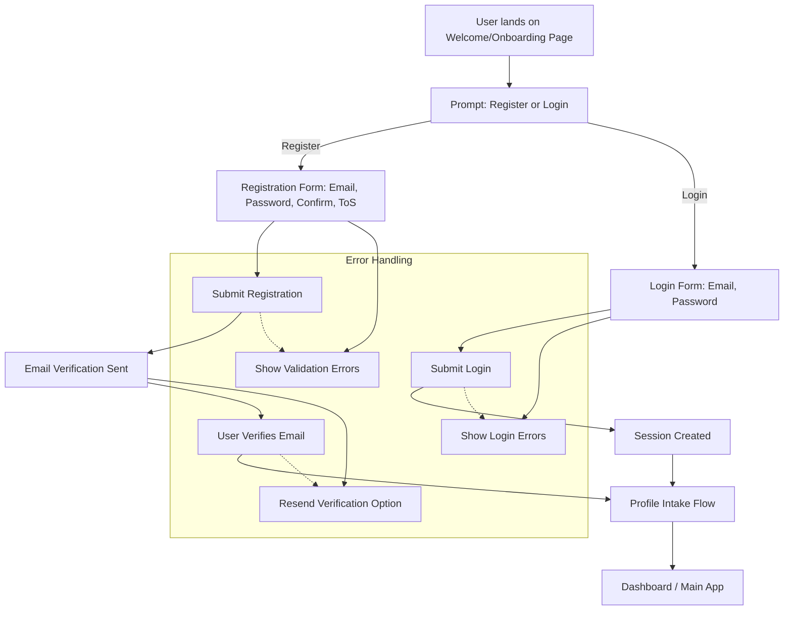

**Epic Title:** Authentication & User Management

**Epic Owner:** Product Owner (PO)

**Goal:** Implement a secure, user-friendly authentication system that supports user registration, login, profile management, and session handling while maintaining data privacy and compliance with Australian regulations.

**Background:**
This epic establishes the foundational user management infrastructure required for the platform. Users need secure access to their profiles, job logs, and generated artifacts. The system must handle user registration, authentication, password management, and profile settings while ensuring data security and privacy compliance. The authentication system should integrate seamlessly with the profile intake flow and support the gamification features.

**Key Features:**

1. **User Registration & Onboarding**
   * Email-based registration with validation
   * Password strength requirements and validation
   * Email verification workflow
   * Terms of service and privacy policy acceptance
   * Initial profile setup integration

2. **Authentication & Login**
   * Secure login with email/password
   * Remember me functionality
   * Session management and timeout handling
   * Failed login attempt tracking and rate limiting
   * Multi-factor authentication preparation (future enhancement)

3. **Password Management**
   * Password reset via email
   * Password change functionality
   * Password strength validation
   * Account lockout protection
   * Secure password storage (hashed)

4. **User Profile Management**
   * User settings and preferences
   * Email notification preferences
   * Privacy settings and data sharing controls
   * Account deletion and data export
   * Profile completion status tracking

5. **Security & Compliance**
   * Data encryption at rest and in transit
   * Audit logging for security events
   * GDPR/privacy compliance features
   * Session security and CSRF protection
   * Input validation and sanitization

6. **Integration with Core Features**
   * Seamless integration with profile intake flow
   * Gamification points tracking per user
   * Job logging and fit score history
   * Artifact generation and storage
   * Notification system integration

**Success Metrics:**
* User registration completion rate
* Login success rate and time to login
* Password reset completion rate
* User session duration and engagement
* Security incident rate (failed logins, suspicious activity)
* User satisfaction with authentication experience
* Profile completion rates after registration
* User retention after first login

**Dependencies:**
* Email service integration
* Database schema for user management
* Security framework and encryption libraries
* Session management system
* Audit logging infrastructure
* Profile intake flow integration
* Gamification engine integration

**Acceptance Criteria:**
* Users can register with email and create secure passwords
* Email verification is required for account activation
* Login is secure and handles failed attempts appropriately
* Password reset functionality works reliably
* User sessions are managed securely with appropriate timeouts
* User data is encrypted and stored securely
* Profile management integrates with the core profile intake flow
* Gamification points are tracked per authenticated user
* Audit logs capture all security-relevant events
* System complies with Australian privacy regulations
* Users can manage their privacy settings and data sharing preferences
* Account deletion provides data export and cleanup options

**Priority:** High

**Tags:** authentication, user-management, security, registration, login, password-management, session-management, privacy, compliance, onboarding, profile-integration, gamification-integration, audit-logging

## User Experience Flow



## Technical Architecture Integration

### Authentication Endpoints

The following API endpoints must be implemented in the backend:

- `POST /api/auth/register` - User registration
- `POST /api/auth/login` - User authentication
- `POST /api/auth/logout` - Session termination
- `POST /api/auth/verify-email` - Email verification
- `POST /api/auth/forgot-password` - Password reset request
- `POST /api/auth/reset-password` - Password reset completion
- `GET /api/auth/profile` - Get user profile
- `PUT /api/auth/profile` - Update user profile
- `GET /api/auth/settings` - Get user settings
- `PUT /api/auth/settings` - Update user settings

### Audit Logging Requirements

All authentication and user management events must be logged with the following structure:

```sql
-- Audit Log Table Schema
CREATE TABLE AuditLog (
    AuditLogID INT IDENTITY(1,1) PRIMARY KEY,
    UserID INT NULL, -- NULL for unauthenticated events
    EventType NVARCHAR(50) NOT NULL, -- 'login', 'register', 'password_reset', etc.
    EventDescription NVARCHAR(500) NOT NULL,
    IPAddress NVARCHAR(45) NOT NULL, -- Supports IPv6
    UserAgent NVARCHAR(500) NULL,
    Timestamp DATETIME2 DEFAULT GETDATE(),
    Success BIT NOT NULL,
    AdditionalData NVARCHAR(MAX) NULL -- JSON for additional context
)
```

### Security Integration

- All endpoints must be protected with CSRF tokens
- Password hashing using bcrypt with salt rounds of 12
- Session management with secure, HTTP-only cookies
- Rate limiting: 5 failed attempts per 15 minutes per IP
- Account lockout after 5 failed attempts for 15 minutes
- All sensitive data encrypted at rest using AES-256
- HTTPS enforcement for all authentication endpoints

### MCP Integration

The authentication system must integrate with the custom MCP service:

- User authentication state managed through MCP session layer
- All database operations routed through MCP for audit logging
- Permission validation handled by MCP before data access
- User context passed to all downstream services via MCP 